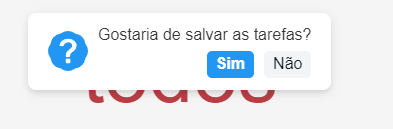
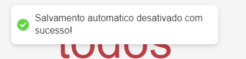
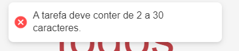

# TodoMCV

 

# 📋 Sobre

O projeto em questão envolve o desenvolvimento de uma aplicação de um todo-list para gerenciar tarefas de forma eficiente e organizada.

 

# 🛠 Tecnologias Usadas

   

 

# 🔮 Funcionalidades:

✅ Requisição de API

✅ Adição, edição e remoção de tarefas

✅ Salvamento no LocalStorage

✅ Listagem de tarefas

✅ Design e Usabilidade

✅ Responsividade

✅ Filtragem de tarefas por "Todos", "Ativos" e "Completos"

✅ Tratamento de erros

✅ Animação

 

 

# 🔧 Entendendo decisões arquiteturais e a estrutura do projeto

### Setup de ambiente:

- [Node](https://nodejs.org/en)

### Como rodar na minha máquina?

- Clone o projeto `git clone https://github.com/matheusleite01/DesafioReactFrontendJunior2024.git`
- Rode `npm install`
- Rode `npm start`
- Pronto 🎉

### Estrutura do projeto

- `./App`: É o componente responsavel por renderizar a aplicação
- `./src/assets`: Contém os arquivos de icones e animação usada no projeto
- `./src/components`: São todos os pedaços primordiais de interface como componentes
- `./src/helper`: Pasta para funções utilitárias ou auxiliares
- `./src/hooks`: Pasta para armazenar custom hooks e boa parte de toda a logica do componente, seguindo o princípio da responsabilidade única do SOLID
- `./src/pages`: Pasta responsavel por armazenar as paginas da aplicação
- `./src/style`: Estilos globais do projeto e variaveis de estilos
- `./src/type`: Responsavel por armazenar a tipagem dos componentes e funções

### Como me localizar no projeto?

- Todos os `componentes` que representam a página home estão em `./src/components`
  - Uma vez dentro de uma página você pode ir navegando pelos componentes para ir se encontrando e fazer a alteração que deseja

# 📝 Salvamento de tarefa no LocalStorage

Normalmente, em uma aplicação real, todas as tarefas registradas pelo usuário viriam de uma API. Pensando nisso, para adicionar um desafio extra ao projeto, optei por incluir a opção de salvar as tarefas utilizando o localStorage.

### Como funciona ?

Assim que o usuário registrar uma nova tarefa, uma notificação aparecerá perguntando se ele deseja salvar suas tarefas. Se escolher sim, todas as tarefas serão armazenadas no localStorage daqui em diante. Ao recarregar a página, as tarefas salvas serão exibidas. É importante notar que, se a opção de salvar estiver ativada, a função 'initialData', responsável por obter as tarefas da API, não será executada para não sobrepor as tasks salvas.

### Como limpar o localStorage?

Pensando na possibilidade de desabilitar esse salvamento, adicionei uma opção para o usuário. Se ele pressionar 'SHIFT + L', o salvamento automático será desativado. Na próxima vez que a página for renderizada, as requisições para a API serão retomadas normalmente.

.png>)

### Demonstração

[screen-capture (1).webm](https://github.com/matheusleite01/DesafioReactFrontendJunior2024/assets/94021070/5b6b2196-543c-40ca-865a-8bdec8331455)

## 📕 Validação nos input

Para melhorar o tratamento de erros no projeto, adicionei uma validação que limita o texto das tarefas de 2 a 30 caracteres. Isso se aplica tanto à criação quanto à edição das tasks.

## 🖌️ Animação

Na minha opinião, uma aplicação de qualidade deve ser lembrada até nos mínimos detalhes. Acredito que é isso que faz um produto ser diferencial. Pensando nisso, criei uma animação de entrada no site usando a logo e também uma após a conclusão das tarefas. As animação foram criadas usando o LootieFiles, que da a possibilidade de exportar as animações em formato json. E para aplicar as animações, utilizei a biblioteca "react-lottie".

